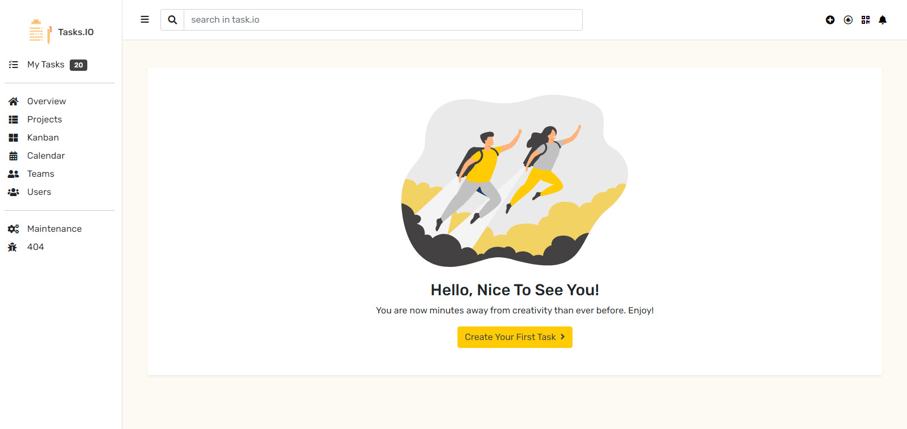
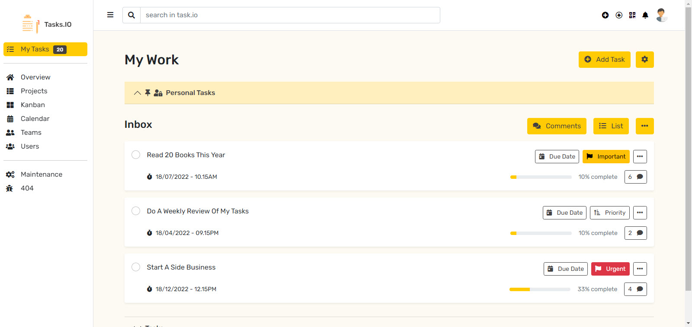
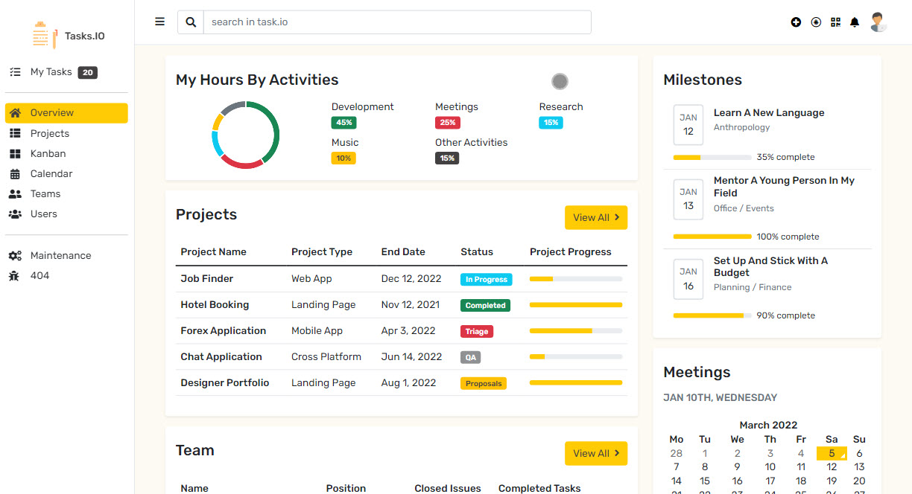
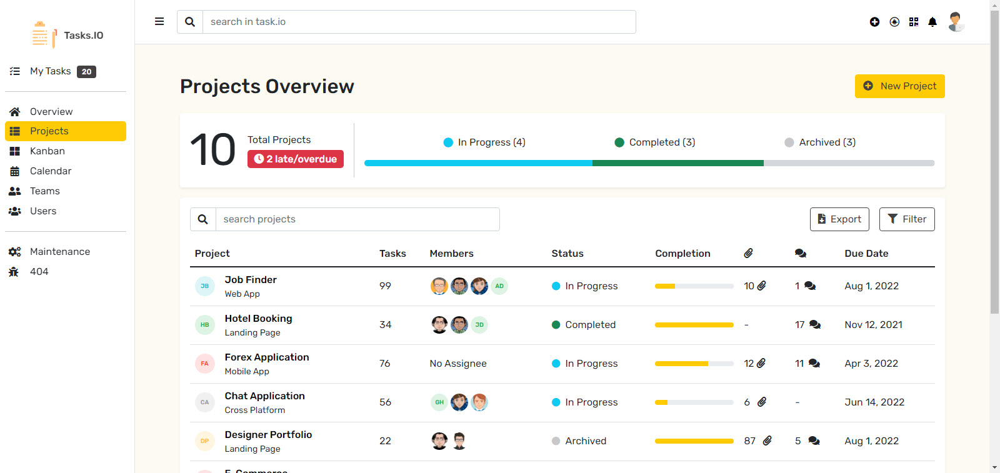
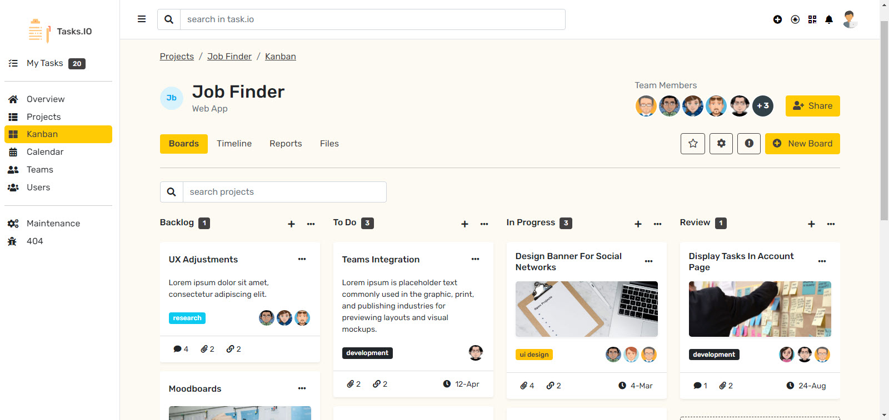
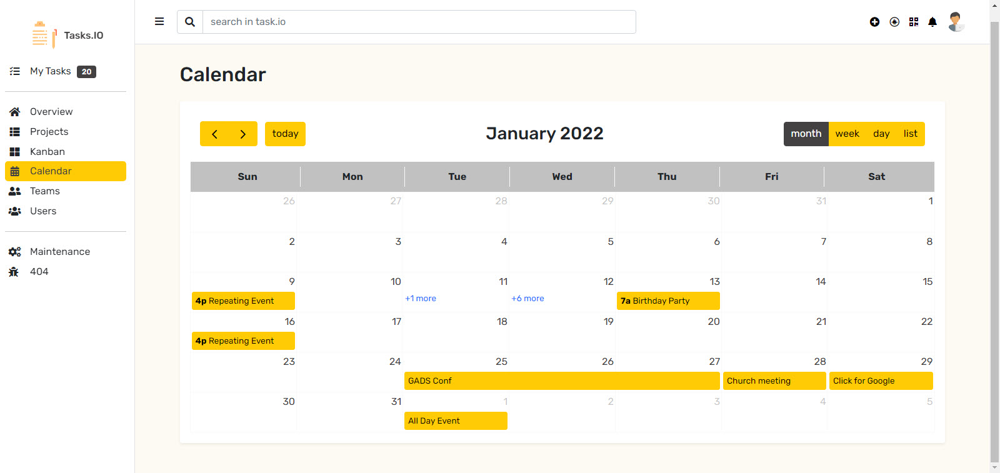
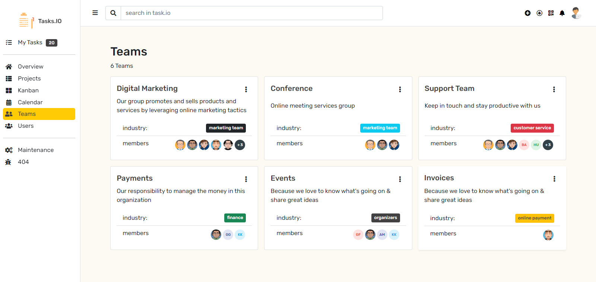
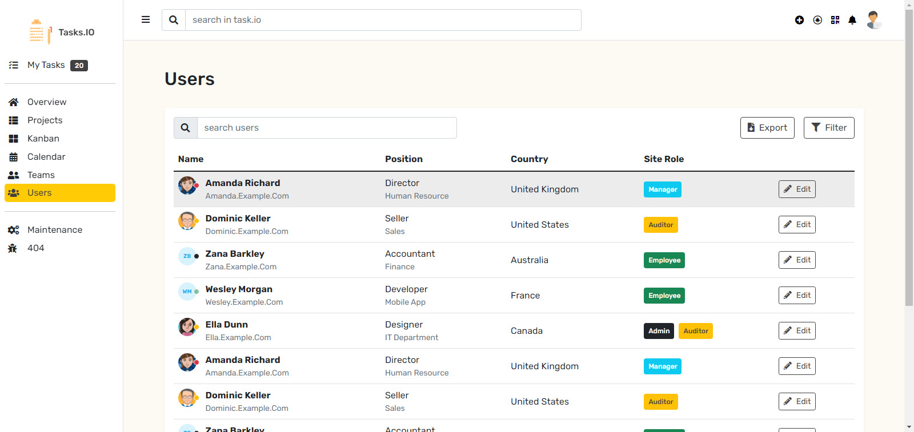
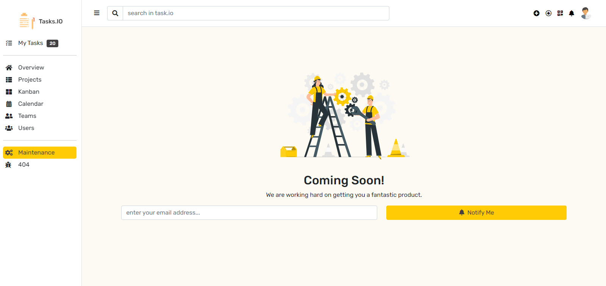
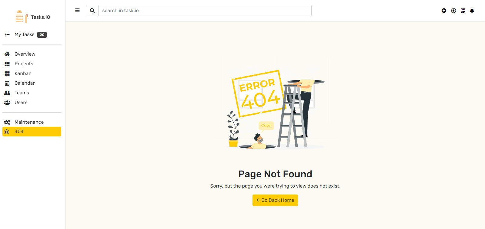

# Task Manager Site
### #11 100 days of website UIs

## Vendor libraries
- [animate-css](https://animate.style/)
- [bootstrap-v5.1.3](https://getbootstrap.com/)
- [chart.js-v2.8.0](https://www.chartjs.org/)
- [dragula-3.7.3](https://bevacqua.github.io/dragula/)
- [jquery 3.6.0](https://jquery.com/)
- [fontawesome-free-5.15.1-web](http://fontawesome.com/)
- [calendar-v2](https://colorlib.com/wp/template/calendar-20/)

## Attribution
Under maintenance image attribution - [work illustration by storyset](https://storyset.com/work)
404 image attribution - [Web illustrations by Storyset](https://storyset.com/web)

## Included pages
#### 1. Getting started

#### 2. My tasks

#### 3. Overview/dashboard

#### 4. Projects overview

#### 5. Kanban

#### 6. Calendar

#### 7. Teams

#### 8. Users

#### 9. Under maintenance

#### 10. 404

